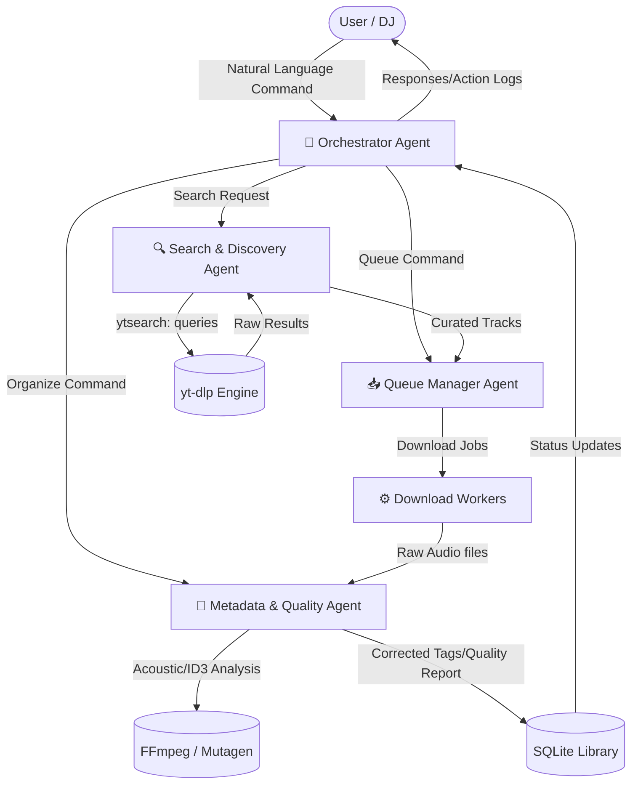

# YouPlumber Multi-Agent Architecture

To evolve YouPlumber into an "agent-heavy" application, we can introduce specialized LLM-powered autonomous agents that manage different aspects of the music acquisition pipeline. This will transform the tool from a manual downloader into an intelligent DJ assistant.

Below is the proposed multi-agent architecture, incorporating the planned **YouTube Search functionality**.

## 🕸️ Agent Topology (Graph)

---

## 🤖 The Agents

### 1. 🧠 Orchestrator Agent
**Role**: The brain of the operation. It receives user inputs (via Web UI chat or CLI natural language) and determines the intent.
- **Responsibilities**:
  - Parse user requests (e.g., *"Find me 10 new afro house tracks, queue them, and make sure they are true 320kbps"*).
  - Delegate sub-tasks to the Search, Queue, and Metadata agents.
  - Report high-level status back to the user via WebSockets or CLI output.

### 2. 🔍 Search & Discovery Agent (New Feature Focus)
**Role**: Replaces manual URL pasting with semantic search and intelligent curation.
- **Responsibilities**:
  - Translate natural language (e.g., *"Trending melodic techno 2026"*) into optimized `ytsearch[N]:` queries for `sources.py`.
  - Parse the raw results from `yt-dlp` and filter out unwanted content (e.g., removing "Live Sets", "Mixes", or "Lyrics Videos" if the user only wants single tracks).
  - Score results based on relevance, view count, and audio length to present the *best* matches to the user or auto-queue them.
  - Suggest similar artists or tracks based on the user's existing database.

### 3. 📥 Queue Manager Agent
**Role**: Intelligently handles the execution of downloads in `downloader.py`.
- **Responsibilities**:
  - Dynamically adjust `concurrent_jobs` based on system load or network rate-limiting.
  - Prioritize tracks based on user urgency or track length (e.g., download shorter tracks first for quick feedback).
  - Analyze yt-dlp errors (like HTTP 429 Too Many Requests) and smartly schedule backoffs or proxy rotations instead of dumb retries.

### 4. 🎵 Metadata & Quality Agent
**Role**: The audiophile checker. Ensures the downloaded library is DJ-ready.
- **Responsibilities**:
  - Monitor the `library` directory after `finalize.py` runs.
  - Use external APIs (like MusicBrainz or Spotify) to cross-reference track titles and automatically fix messy YouTube titles (e.g., stripping out `[Official Music Video] 1080p`).
  - **Quality Check**: Run spectrum analysis (via FFmpeg) to detect "fake" 320kbps files (e.g., 128kbps audio upscaled to 320kbps, which looks bad on club speakers) and flag them in the SQLite DB.
  - Auto-calculate and tag BPM / Camelot Key if missing.

## 🚀 Implementation Plan for Search Functionality

1. **Extend `sources.py`**: Wrap the existing `ytsearch:` logic with an LLM prompt that takes a user query, generates multiple variations of the search term, and aggregates the results.
2. **Add a Chat UI**: Add a chat interface to `index.html` communicating over a new WebSocket endpoint in `server.py` (`/ws/agent`).
3. **Agent Coordination**: Create a new `agents.py` module containing the Orchestrator that parses the chat input, calls `sources.search()`, evaluates the responses with the Search Agent, and then pushes selected tracks to the Download Queue.
